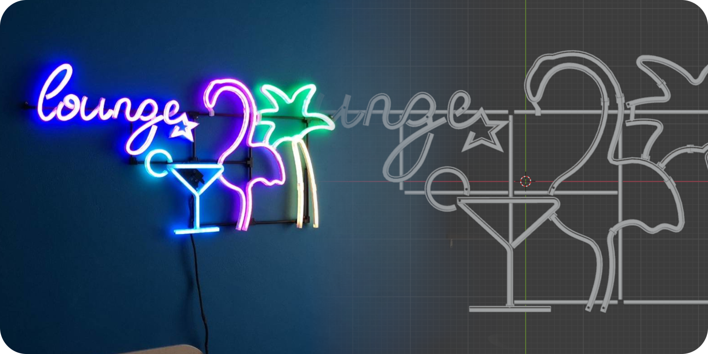

# LED Lounge Neon!
An RGB LED neon project using 3d printed parts and custom AVR-based controller board with included software.

## PCB
Printed circuit board design (one-layer) files can be found inside ['/pcb'](/pcb). It was created in KiCad open-source
EDA.
The design includes all the parts names,
package formats, and source schematic. It can all be found by opening ['pcb.pro'](/pcb/pcb.pro). file.

## AVR source code and binary
The controller board uses a popular MCU, an ATmega168p. Software source can be found inside ['/src'](/src).
Compile using the included shell script, or create a makefile for yourself. The binary file ['/src/bin/out.bin'](/src/bin/out.bin)
can be directly uploaded to a matching MCU by using the 'upload.sh' script - it assumes your serial-usb converter is connected to
/dev/ttyUSB0 and has a USART capable bootloader. Modify if needed.

## 3D Models for printing
Can be found inside ['/resource_3d'](/resource_3d). Those are all Blender files. 
All necessary STL exports are already made and contained within stl_* folders. 
Slice using your favourite tool, and print! 
(All models are optimised to fit a PRUSA Mini or bigger - min. work area of 175 x 175 x 175mm).

